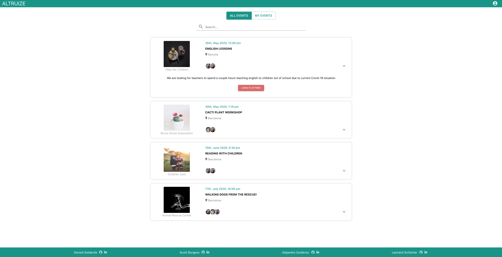
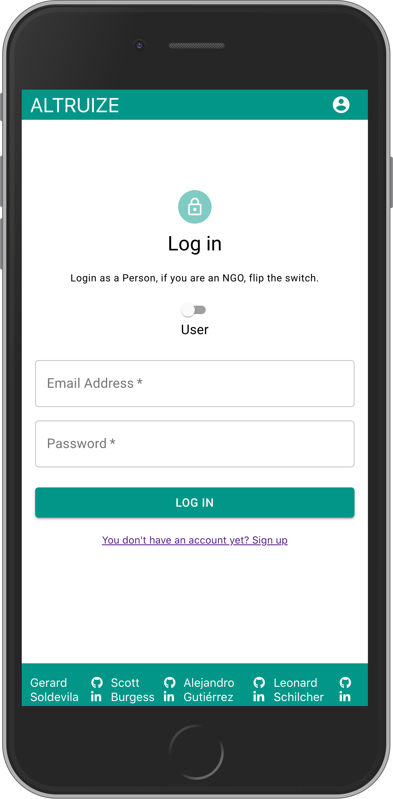
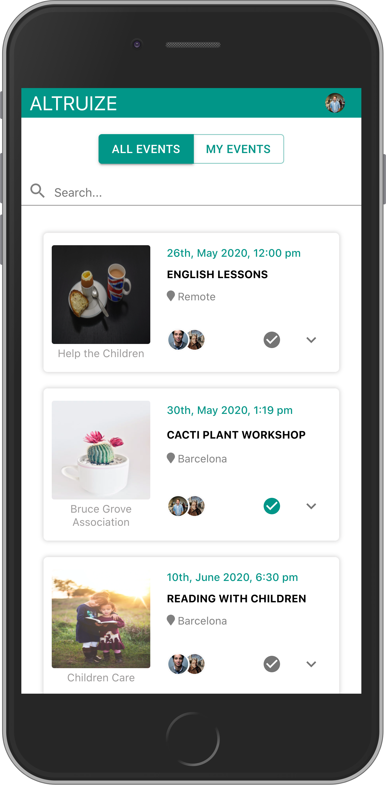
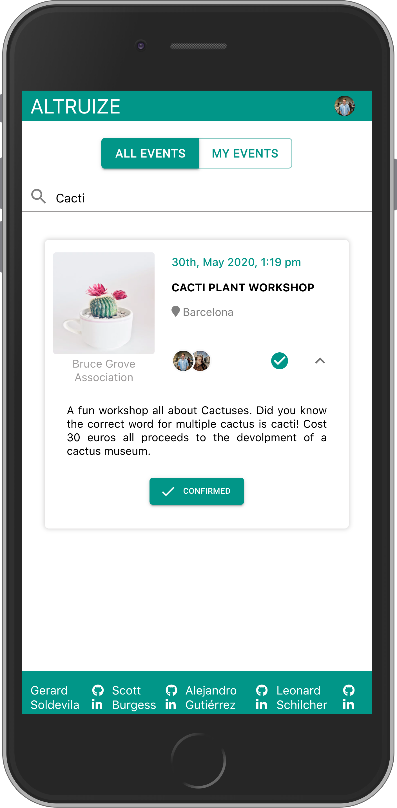
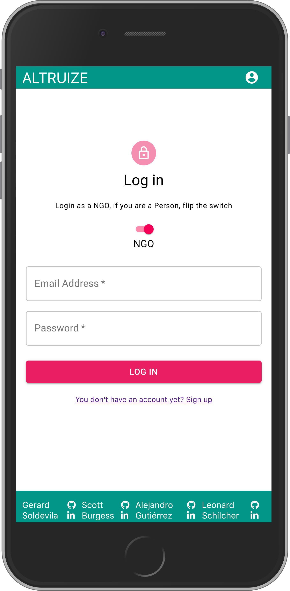
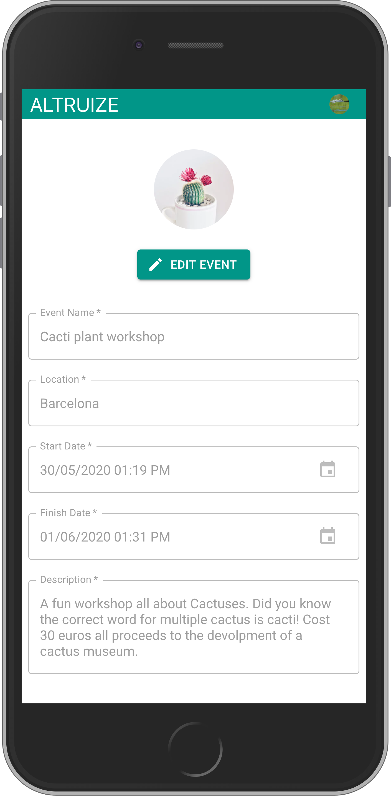
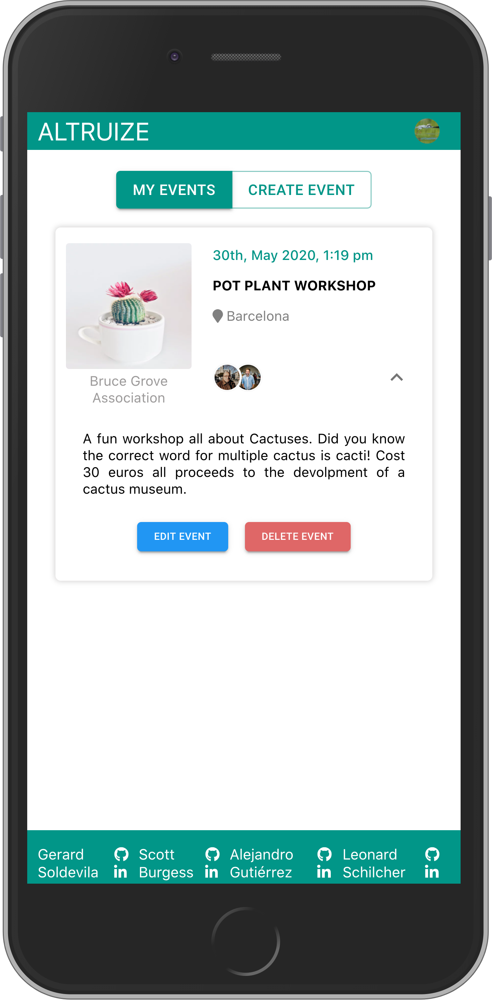

# [Altruize](https://altruize.herokuapp.com/)
Altruize is a platform that allows registered nonprofit organizations to ask for help from short term volunteers.     
Check it out at https://altruize.herokuapp.com/

    
<div>
  
</div>

## User flow

<div align='center'>
  
  
  
</div> 

## Ong flow

<div align='center'>
  
  
  
</div> 

## 🧪 Want to use this project?
Check, explore and remix it!
<details><summary>See instructions</summary><br>
    
#### 1. Fork and the clone the repository       
#### 2. In the root directoy run `npm run install:all`.       
#### 3. Add your env variables:       
#### 3.1 server --> .env.example (save as .env)     

```txt
PORT=<the port you like but no 3000>
PSQL_DB_NAME=<'db name'>
PSQL_DB_USER=<'user name'>
PSQL_DB_PASSWORD=<'leave it blank if you dont want a password'>
PSQL_DB_HOST='localhost'
TOKEN_SECRET=<'a secret alpahumeric string'>
```
#### 4. Start your postgresSQL
#### 5. In the root directoy run `npm run start:all`.
#### 6. 🚀 Open [http://localhost:3000](http://localhost:3000) to view it in your browser, and start using the app!

</details>

## 🥞 Stack

### Front-End
* React with material ui.
* Redux and React-router.

### Back-End
* Node.js with Express for the server.
* PostgreSQL with sequalize for the database.  

## 👨‍💻👨‍💻👨‍💻👨‍💻  Team
[Scott Burgess](https://github.com/Scottburg)     
[Alejandro Gutiérrez](https://github.com/AlejandroGutierrezB)     
[Leonard Schilcher](https://github.com/LeonardvS)     
[Gerard Soldevila](https://github.com/gsolde)    

     
